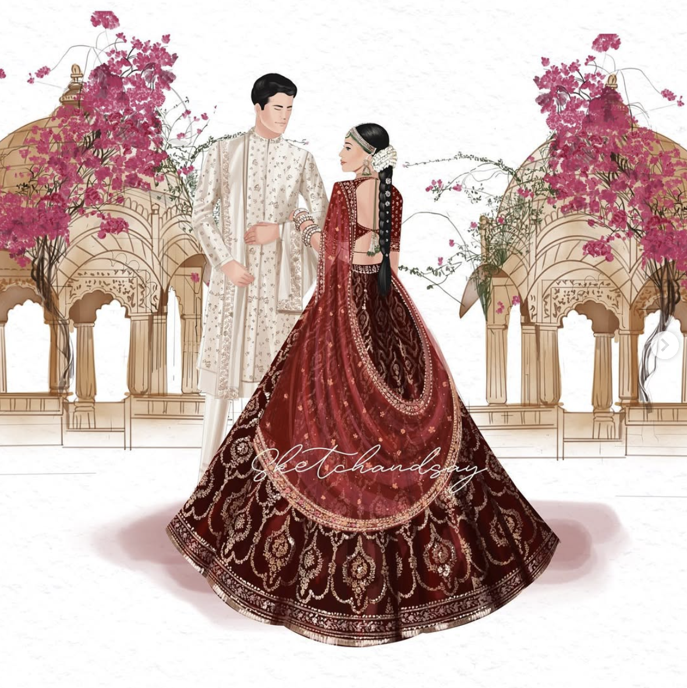

# Wedding Invitation

This project is a simple and elegant wedding invitation webpage designed to invite guests to a wedding ceremony. It includes details about the bride and groom, the wedding date, venue, and schedule, along with a map and contact information.

## Features

- **Beautiful Design**: Styled with custom fonts and a watercolor background for a classy look.
- **Bride and Groom Details**: Names and an illustration of the couple.
- **Event Schedule**: Detailed timeline of wedding events.
- **Venue Information**: Includes venue details and an embedded YouTube video showcasing the venue.
- **Google Maps Integration**: Embedded map for easy navigation.
- **Contact Information**: Phone numbers for RSVP and inquiries.

## File Structure

- **index.html**: The main HTML file containing the structure of the wedding invitation.
- **style.css**: The CSS file for styling the webpage.
- **groom-bride.png**: An illustration of the bride and groom.
- **README.md**: This file, providing an overview of the project.

## How to Use

1. Clone or download this repository.
2. Open `index.html` in any modern web browser to view the wedding invitation.

## Fonts Used

The webpage uses the following Google Fonts:
- Lavishly Yours
- Imperial Script
- Tangerine

## Preview

## License

This project is for personal use only and is not intended for commercial purposes.